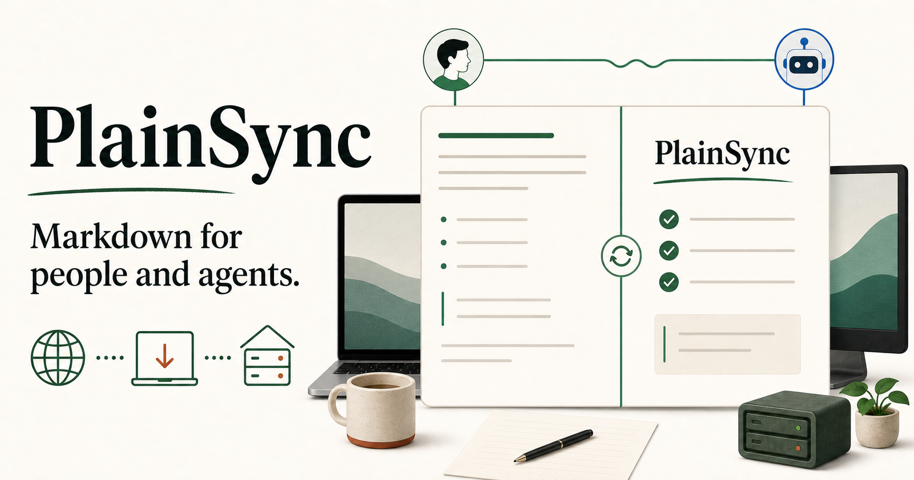

# PlainSync

PlainSync is an open-source, local-first Markdown workspace for people and AI agents. It keeps Markdown as plain text, gives humans a calm writing and preview experience, and makes sharing self-hostable.



## What works today

- Open, drag, edit, preview, and export `.md` files.
- GitHub-Flavored Markdown, tables, task lists, and fenced code blocks.
- Local drafts saved on the device with no account.
- Conflict-free Yjs collaboration with live presence.
- Separate editor, commenter, and read-only invitation links.
- Text-anchored comments with resolve/reopen controls.
- Automatic history, named snapshots, and one-click restoration.
- Revision-aware REST API with a live OpenAPI document for agents.
- Installable PWA for macOS and Windows.
- Light and dark modes, keyboard shortcuts, and responsive layouts.
- Cloudflare Workers + D1 deployment.
- Docker/VPS deployment with a persistent local data volume.

PlainSync is an alpha. Yjs updates currently travel over a small polling transport so the same collaboration model works on Cloudflare Workers and an ordinary VPS without extra infrastructure. Inline suggestion acceptance, Git adapters, CLI file watching, SDKs, and MCP tools are on the public roadmap.

## Start locally

PlainSync requires Node.js 22 or newer.

```bash
git clone https://github.com/everyai-com/plainsync.git
cd plainsync
npm install
npm run dev
```

Open `http://localhost:3000`. The same commands work in Terminal on macOS, PowerShell on Windows, and a Linux shell.

### Install it as a desktop app

Open PlainSync in Chrome or Edge, then select **Install PlainSync** from the browser menu. It opens in its own window on macOS and Windows and retains local drafts for offline use.

## Self-host on a VPS

Install Docker and run:

```bash
docker compose up -d
```

PlainSync is available at `http://your-server:3000`. Shared documents are stored in the `plainsync-data` Docker volume. Updating is intentionally ordinary:

```bash
git pull
docker compose up -d --build
```

For a public server, put Caddy, nginx, Traefik, or your existing HTTPS proxy in front of port 3000. See [the VPS guide](docs/SELF-HOSTING.md#vps-with-docker) for a Caddy example and backups.

## Deploy to Cloudflare

You need a Cloudflare account and Wrangler authentication. The deploy script works on macOS, Windows, and Linux:

```bash
npm install
npx wrangler login
npm run deploy:cloudflare
```

The script finds or creates a D1 database, builds the application, wires the database binding, and deploys the Worker. See [the Cloudflare guide](docs/SELF-HOSTING.md#cloudflare-workers--d1).

## Keyboard shortcuts

| Action | macOS | Windows/Linux |
| --- | --- | --- |
| Open Markdown | `⌘ O` | `Ctrl O` |
| Save Markdown | `⌘ S` | `Ctrl S` |
| Create/copy current share link | `⌘ ⇧ S` | `Ctrl Shift S` |

## How shared links work

Creating a shared document generates independent 192-bit editor, commenter, and read-only keys. Only SHA-256 hashes are stored on the server. Each key remains in the URL fragment, which browsers do not send in normal HTTP requests; the PlainSync client sends it in an authorization header when using the document API.

Possession of a link grants the role shown when it was copied. Treat links like private invitations. Account-backed membership, expiry, and key rotation remain future work.

## Agent API

Every shared document is available through a revision-aware REST API. The running instance publishes its OpenAPI description at `/api/openapi`. See [the agent API guide](docs/AGENT-API.md) for safe read, edit, history, comment, and Yjs synchronization examples.

## Architecture

The web application consumes the same Markdown and synchronization interfaces used by its API. Cloudflare stores shared documents in D1. The VPS build uses an atomic JSON store in the mounted `/data` volume, so it needs no external database.

Read [ARCHITECTURE.md](ARCHITECTURE.md) for boundaries, storage choices, and the path toward reusable collaboration packages and agent tools.

## Development

```bash
npm install
npm run dev
npm run lint
npm test
```

Database schema changes live in `db/schema.ts`. Generate migration files with:

```bash
npm run db:generate
```

See [CONTRIBUTING.md](CONTRIBUTING.md) before opening a pull request.

## License

Apache-2.0. Use PlainSync privately, commercially, or as a foundation for another product. Attribution and license notices must be retained.
